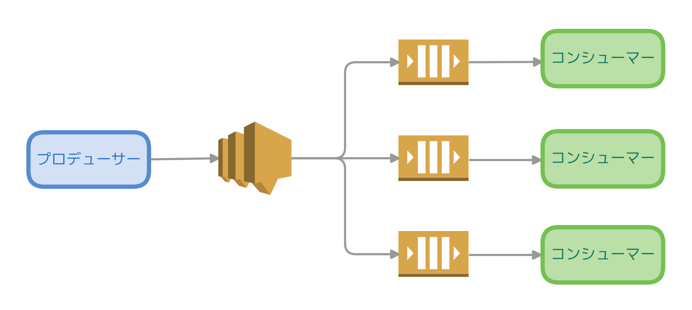

# SNS+SQSによるサービス間通信

## 概要

本レポジトリは[AWS SDK for Go](https://aws.amazon.com/jp/sdk-for-go/)を利用したSNS+SQSによる非同期的メッセージの実装例になります。

<p align="center">
  
</p>

## セットアップ

以下のドキュメントを参照しながら、SNSトピックにサブスクライブされたSQSキューを作成しましょう。

- [Amazon SNS トピックの作成](https://docs.aws.amazon.com/ja_jp/sns/latest/dg/CreateTopic.html)
- [Amazon SQS キューの作成](https://docs.aws.amazon.com/ja_jp/AWSSimpleQueueService/latest/SQSDeveloperGuide/sqs-getting-started.html)
- [Amazon SNS トピックへの Amazon SQS キューをサブスクライブする](https://docs.aws.amazon.com/ja_jp/AWSSimpleQueueService/latest/SQSDeveloperGuide/sqs-subscribe-queue-sns-topic.html)

それから以下の環境変数を設定します。

```bash
# AWSのアクセスキー
export AWS_ACCESS_KEY_ID="xxx"
# AWSのシークレットアクセスキー
export AWS_SECRET_ACCESS_KEY="xxx"
# AWSのリージョン
export AWS_DEFAULT_REGION="ap-northeast-1"
# SNSトピックのARN
export TOPIC_ARN="arn:aws:sns:ap-northeast-1:xxx:xxx"
# SQSキューのURL
export QUEUE_URL="https://sqs.ap-northeast-1.amazonaws.com/xxx/xxx"
```

## 実行

`go run main.go`を実行すると以下のように出力されます。

```
発行：Message 0
受信：Message 0
削除：Message 0
発行：Message 1
受信：Message 1
削除：Message 1
発行：Message 2
受信：Message 2
削除：Message 2
...
メッセージはありませんでした
```